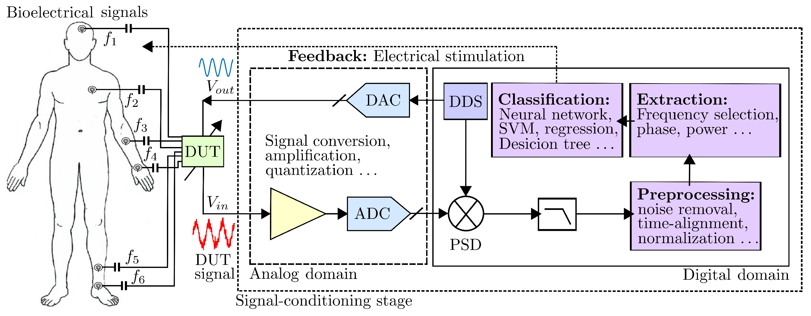
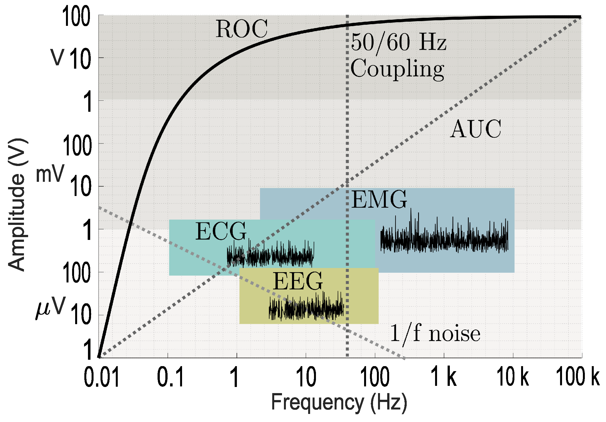
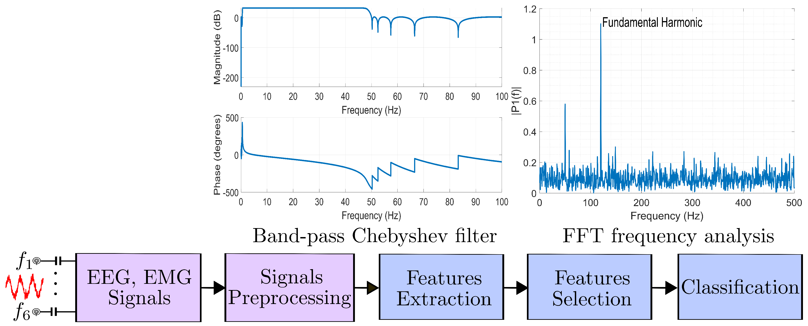

## Overview

Developed a fully digital **lock-in amplifier (LIA)** system implemented on FPGA, targeting advanced measurement applications where extracting weak signals buried in noise is critical. This project resulted in two peer-reviewed publications.

*Figure 8. Block diagram classification with analog components and digital FPGA-based design blocks for the analysis and digital conditioning of bioelectrical signals. (Sensors 25(2), 584, 2025 — CC BY 4.0)*

*Figure 10. Signal characteristics with the frequency/amplitude relationship. (Sensors 25(2), 584, 2025 — CC BY 4.0)*

*Figure 11. System key building blocks for the processing signals at the hardware integrated circuit. (Sensors 25(2), 584, 2025 — CC BY 4.0)*

## Key Contributions

- Designed the complete **digital signal processing pipeline** in VHDL: reference signal generation, phase-sensitive detection, and configurable low-pass filtering stages for in-phase (I) and quadrature (Q) outputs.
- Developed a **reliable verification methodology** combining simulation-based functional verification with quantitative noise analysis, characterizing SNR performance across operating conditions.
- Published a **comprehensive review** of FPGA-based LIA architectures for measurement applications (Sensors, 2025), covering design strategies, signal enhancement techniques, and implementation tradeoffs.
- Published the **verification and noise analysis methodology** in IEEE Embedded Systems Letters (2024), providing a reproducible framework for FPGA-based instrumentation design.

## Tools & Technologies

VHDL, Quartus Prime, ModelSim, MATLAB (fixed-point analysis and noise characterization), UVM-based testbenches.

## Impact

Lock-in amplifiers are essential instruments in spectroscopy, materials characterization, and sensor readout. This FPGA-based approach enables real-time, low-latency operation suitable for embedded measurement systems where commercial benchtop LIAs are impractical.
